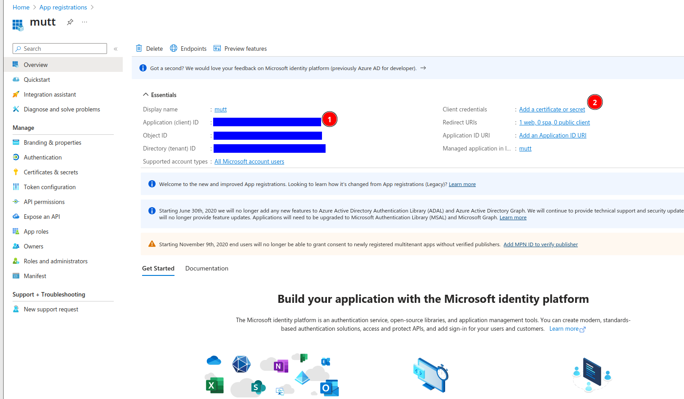

# Microsoft OAUTH2 Authentication Flow for (neo)mutt

## Introduction

This guide serve as a base to setup an OAUTH2 Authentication Flow to use with the following programs:

- [msmtp](https://marlam.de/msmtp/)
- [(neo)mutt](https://neomutt.org)
- [isync/mbsync](http://isync.sourceforge.net/)
- [goimapnotify](https://gitlab.com/shackra/goimapnotify/-/tree/master)

## Register a Microsoft Web Application (ClientId e ClientSecret)

1. Go to <https://entra.microsoft.com/>
2. Register a new application:
   1. 
   2. 
3. Copy the client Id and create a new client secret:
   1. 
   2. 
   3. 
4. Setup API permissions:
   1. 
   2. 
   3. Add the following API persmissions:
      1. `offline_access` (Microsoft Graph, Delegated)
      2. `IMAP.AccessAsUser.All` (Microsoft Graph, Delegated)
      3. `POP.AccessAsUser.All` (Microsoft Graph, Delegated)
      4. `SMTP.Send` (Microsoft Graph, Delegated)
      5. `User.Read` (Microsoft Graph, Delegated)

## Configure `mutt_oauth2.py`

Use `gpg -k` to list the recipients

```sh
rm -rf ~/email.token
/usr/share/neomutt/oauth2/mutt_oauth2.py \
    --verbose \
    --authorize \
    --provider microsoft \
    --email "<email>" \
    --decryption-pipe="gpg --decrypt" \
    --encryption-pipe "gpg --encrypt --default-recipient-self" \
    --client-id '<client-id>' \
    --client-secret '<client-secret-specify-only-if-web-app>' \
    --authflow localhostauthcode \
    ~/email.token
```

Test that it works:

```sh
/usr/share/neomutt/oauth2/mutt_oauth2.py ~/email.token --provider microsoft --verbose --test
```

Fetch the token with the following approach:

```sh
/usr/share/neomutt/oauth2/mutt_oauth2.py ~/email.token
```

## Configuration

### `mbsync`

```conf
IMAPStore <email>-remote
Host outlook.office365.com
Port 993
User <email>
PassCmd "/usr/share/neomutt/oauth2/mutt_oauth2.py <token-file-path>"
AuthMechs XOAUTH2
TLSType IMAPS
CertificateFile /etc/ssl/certs/ca-certificates.crt
```

### `msmtp`

```conf
account <account-name>
auth xoauth2
host <smtp-server>
protocol smtp
from <email-address>
user <username>
passwordeval /usr/share/neomutt/oauth2/mutt_oauth2.py <token-file-path>
```

### `goimapnotify`

```yaml
configurations:
    - host: example.com
      port: 143
      tls: true
      tlsOptions:
        rejectUnauthorized: false
        starttls: true
      alias: ExampleCOM
      username: USERNAME
      # passwordCommand: 'pizauth show <pizauth-account-name>'
      passwordCommand: '/usr/share/neomutt/oauth2/mutt_oauth2.py <token-file-path>'
      xoAuth2: true
      onNewMail: ''
      onNewMailPost: ''
      onDeletedMail: ''
      onDeletedMailPost: ''
      boxes:
        - mailbox: INBOX
          onNewMail: 'mbsync examplecom:INBOX'
          onNewMailPost: SKIP
        - mailbox: Junk
          onNewMail: 'mbsync examplenet:Junk'
          onNewMailPost: SKIP
```

## Additional Resources

- `mutt_oauth2.py`:
  - <https://github.com/neomutt/neomutt/blob/main/contrib/oauth2/README.md>
  - <https://github.com/neomutt/neomutt/blob/main/contrib/oauth2/mutt_oauth2.py>
  - /usr/share/neomutt/oauth2/mutt_oauth2.py
  - /usr/share/neomutt/oauth2/README.md
- [pizauth](https://github.com/ltratt/pizauth)
- [email-oauth2-proxy](https://github.com/simonrob/email-oauth2-proxy)
- [oauth2ms](https://github.com/harishkrupo/oauth2ms)
- [oama](https://github.com/pdobsan/oama)
- <https://learn.microsoft.com/en-us/entra/identity-platform/quickstart-register-app?tabs=certificate%2Cexpose-a-web-api>
- <https://sites.uw.edu/bxf4/2022/09/01/getting-uw-outlook-365-oauth2-to-work-with-emacs-mu4e-mbsync-and-msmtp/>
- <https://brettpresnell.com/post/email/>
- <https://simondobson.org/2024/02/03/getting-email/>
- https://learn.microsoft.com/en-us/exchange/client-developer/legacy-protocols/how-to-authenticate-an-imap-pop-smtp-application-by-using-oauth
- https://learn.microsoft.com/en-us/entra/identity-platform/v2-app-types
  - https://learn.microsoft.com/en-us/entra/identity-platform/v2-oauth2-auth-code-flow
  - https://learn.microsoft.com/en-us/entra/identity-platform/v2-oauth2-client-creds-grant-flow
    - https://learn.microsoft.com/en-us/powershell/module/pki/new-selfsignedcertificate?view=windowsserver2022-ps
  - https://learn.microsoft.com/en-us/entra/identity-platform/v2-oauth2-device-code
